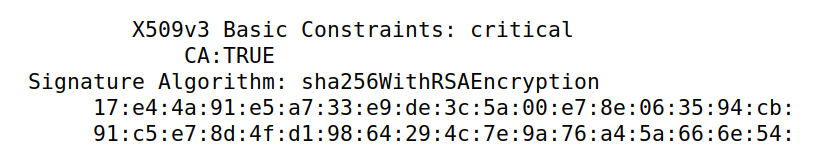
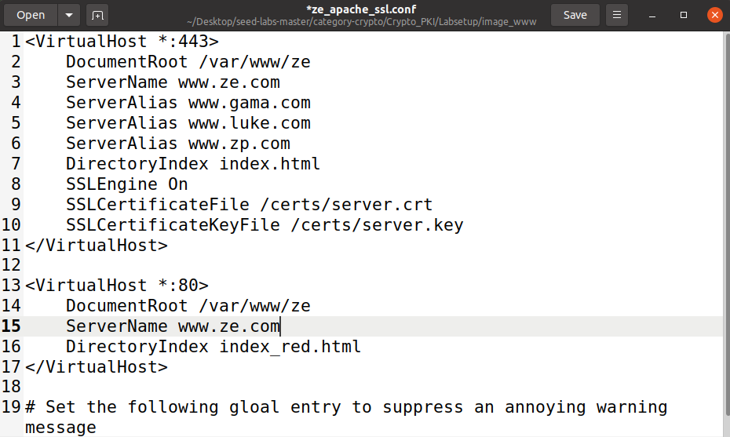
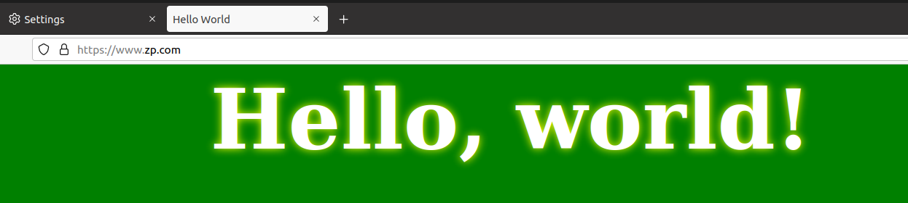
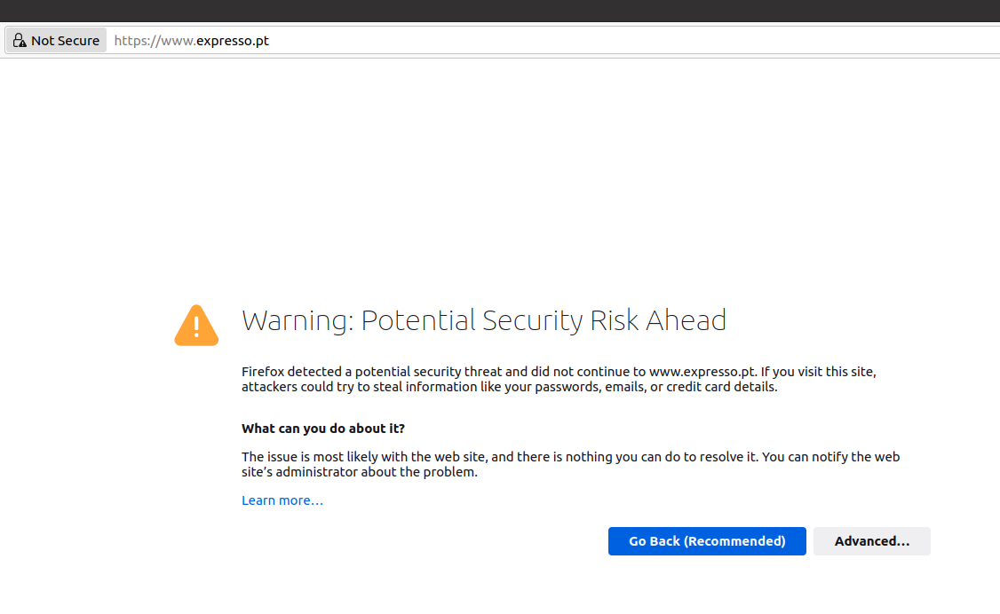
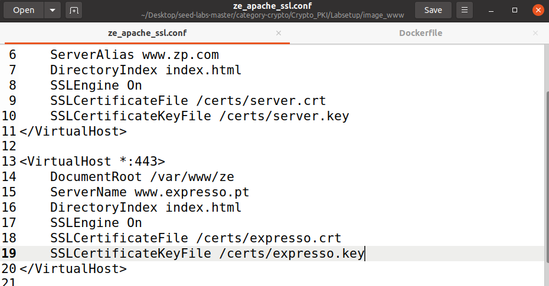
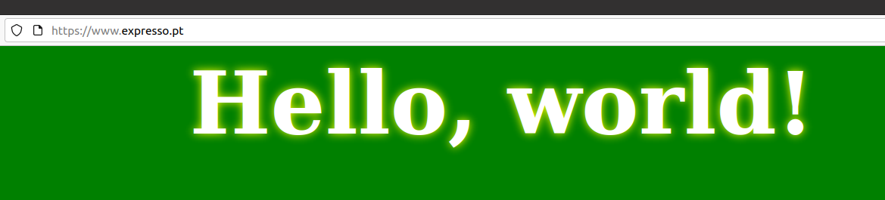

# SEED Labs

## Public-Key Infrastructure (PKI) Lab

###  Task 1: Becoming a Certificate Authority (CA)

- What part of the certificate indicates this is a CA’s certificate?

- If the CA flag is true then it is a CA, otherwise then it is not a CA.



- What part of the certificate indicates this is a self-signed certificate?

- We observed that boths the Subject key and the Authority identifier are the same, therefore it is a self-signed certificate.


- In the RSA algorithm, we have a public exponent e, a private exponent d, a modulus n, and two secret
numbers p and q, such that n = pq. Please identify the values for these elements in your certificate
and key files.

- **modulus (n)**:
    00:b0:ad:7e:24:7d:75:43:1e:6a:9d:41:a9:de:54:
    08:6b:ea:d8:0e:25:70:14:6a:d7:d1:ff:8c:f8:d0:
    ad:e1:d2:56:08:aa:b2:2a:78:e9:43:a1:f6:4d:18:
    56:b3:06:0e:a4:28:0f:3a:10:c3:c8:38:f9:ae:9e:
    58:dc:fc:0a:23:8c:21:8a:fb:8a:da:9c:b3:d7:1e:
    32:96:1a:4b:a0:55:55:3d:2d:39:2d:df:28:05:04:
    a6:b2:79:f4:3e:3c:39:8e:f3:16:3c:09:96:ca:4e:
    7d:df:91:6e:c4:6a:48:db:2e:5f:02:92:69:5e:75:
    72:5b:66:ea:95:2f:e0:b5:25:ee:8c:9b:ef:a8:d7:
    a4:bf:52:be:c0:c8:00:e6:87:17:fa:66:e6:17:e8:
    53:70:76:bc:31:9f:d3:d4:01:7a:b5:8f:01:ef:c8:
    13:ec:c6:ce:39:df:12:f7:d7:e5:85:e1:6f:71:a8:
    74:7b:bc:04:9d:b4:86:ae:33:53:ba:8f:56:b5:4e:
    06:5b:43:a9:10:26:d2:69:cd:5f:32:8a:f4:2a:21:
    7c:88:b0:6e:a9:9e:be:e4:9c:a4:ee:4a:88:4d:d4:
    87:6c:f8:e4:79:b6:71:66:77:97:91:1b:8f:9f:ec:
    e1:2a:e2:a0:5e:14:a7:07:7a:e0:37:4e:97:11:72:
    2d:81:32:5a:dc:6b:03:1e:8d:bc:06:c4:2d:40:43:
    2f:3e:07:d2:bc:33:1f:06:11:86:f9:4e:df:96:a8:
    27:ba:9c:e9:cc:76:b5:e6:fb:37:b5:c3:99:fd:3a:
    64:68:52:4a:1e:41:18:bb:21:20:15:1a:6c:27:2b:
    f2:45:4a:5b:ac:05:16:1d:3d:2f:09:b5:42:95:09:
    a7:6a:a8:52:17:00:25:0d:cf:82:e8:ac:7d:bc:55:
    44:ce:40:66:63:c3:e4:1d:1c:30:ed:5b:86:7e:81:
    0b:d0:84:8a:06:c0:ed:70:e5:e2:ce:37:53:2a:68:
    c8:4f:44:86:43:ed:d6:b9:fd:93:e4:93:38:d9:48:
    55:4b:00:3b:33:09:15:c1:c4:d5:d3:91:e6:8a:e9:
    4c:3a:e4:87:48:05:4a:dc:6c:fc:92:58:75:a5:f4:
    68:f1:55:56:21:cf:21:13:0a:4c:20:e1:98:8c:9a:
    46:86:02:4d:f5:f9:0e:cf:c0:c2:72:f8:cc:95:45:
    88:5c:52:78:66:dd:10:32:ef:3c:cc:62:69:71:d6:
    b8:f2:a4:34:4b:31:3b:be:d8:bb:6b:67:6b:f0:7e:
    d3:dd:4c:62:3f:9e:a2:23:ad:0c:e9:0f:f8:24:e2:
    cb:d8:63:d7:5f:61:5d:b6:6f:a8:7d:d9:ec:c7:0d:
    40:6e:9d
- **publicExponent (e):** 65537 (0x10001)
- **privateExponent (d):**
    00:9b:94:7b:83:48:93:2d:42:a8:a1:c8:43:fc:cb:
    45:0b:3b:27:7c:f5:8c:c7:fd:fa:05:2b:a3:89:2b:
    c2:23:1c:a4:b4:47:14:53:80:5b:f1:39:bb:79:d2:
    57:ee:98:03:e6:9c:7c:24:26:c5:31:18:b3:0e:08:
    d4:b9:ec:9c:45:07:4e:36:64:21:b7:36:cc:cb:3f:
    05:4e:d6:e3:07:d2:7d:18:3d:2d:9f:ee:66:00:5d:
    43:29:e1:68:aa:31:40:82:58:1f:99:48:dc:67:54:
    4d:55:c5:6c:a4:3b:ef:e2:4a:e8:51:8c:7a:8b:3a:
    a3:34:47:e1:84:f4:3f:4d:65:94:b6:6f:4e:d1:00:
    ec:4b:aa:62:dd:c2:81:c0:7e:f0:27:89:db:4e:ec:
    40:25:c5:f9:1d:3d:e0:3c:4d:fd:2f:ca:39:eb:5b:
    e5:e7:d8:7d:9b:ca:8b:9a:82:9c:d4:93:5b:1e:dc:
    37:8f:0a:57:8a:44:81:60:ff:43:d9:02:06:59:eb:
    d6:7f:21:8a:cb:f5:53:ce:e5:91:d2:21:38:b7:ac:
    fb:4c:27:09:9c:06:75:95:3d:37:a3:bb:30:62:51:
    27:dc:57:24:62:e5:bc:e0:7d:a9:93:97:90:97:44:
    f2:57:60:6f:d5:c9:1b:f8:e3:44:74:8f:99:4a:3c:
    a0:42:30:b2:20:3b:f5:41:ed:a1:40:76:c4:8a:91:
    63:af:ae:48:18:67:78:5c:24:c8:37:63:c8:56:c3:
    74:27:d1:1b:7f:75:32:12:cf:14:ca:b9:5b:4c:52:
    42:cb:33:37:86:cd:ef:5d:3b:54:8a:1f:62:5a:bf:
    7e:66:85:06:bb:cd:10:e6:05:3b:85:40:86:6a:3e:
    73:21:b5:44:1e:54:06:7a:ae:6d:97:1d:90:c2:6e:
    fb:0e:f3:b8:ef:3f:f7:6a:e5:71:17:1b:71:39:14:
    f4:ad:48:ca:5d:02:d2:1f:fc:22:75:b5:15:31:de:
    ec:26:81:74:f1:58:20:78:dd:b4:86:b9:11:45:b4:
    55:6b:0d:5b:a4:92:35:2e:bb:36:54:1f:30:18:33:
    e9:53:20:d5:48:03:4f:a8:b0:ca:cd:84:c1:ed:30:
    52:19:66:7f:ad:9c:72:5d:37:de:c1:f5:c4:47:a2:
    d5:70:5c:82:97:d4:e3:2e:9b:d9:0d:a6:b8:35:0b:
    c6:38:74:13:27:97:86:4a:f8:e2:9f:1c:d6:ff:61:
    13:70:e7:04:a2:4d:cd:ce:2c:71:cb:ad:e8:ca:15:
    1f:a0:77:8f:22:66:e2:d6:4f:6f:c2:49:7f:f9:6f:
    b1:84:e8:44:ae:11:f7:76:5b:f3:08:e5:bd:54:87:
    0e:8c:81
- **p:**
    00:e2:b0:d7:ff:e6:ce:75:f1:e4:af:04:d6:db:29:
    f7:f2:d6:ff:d9:40:6e:ac:34:28:82:a1:26:10:e3:
    81:02:27:ca:ae:d9:1a:87:2d:28:cc:9d:83:bd:91:
    18:7d:20:88:85:04:65:6b:75:5a:55:0d:c0:f0:79:
    3d:f6:db:d0:10:7d:f7:58:56:23:08:68:53:f4:82:
    e0:dd:f5:c2:71:fd:a8:45:0b:0d:84:8e:b1:4e:fe:
    18:5b:87:e0:b2:8e:97:66:85:5d:39:53:c4:5b:c4:
    2d:2a:95:b2:e7:8e:b7:a0:5b:18:36:85:8d:fb:66:
    fe:98:90:37:d7:52:cf:c8:5b:78:2c:cf:8b:bc:26:
    6a:a1:38:45:6c:d7:49:8e:7f:9b:87:dc:70:5f:fd:
    48:87:9f:8e:02:03:cf:d9:64:13:a9:ef:97:7f:07:
    40:77:5d:b8:91:e3:fe:31:71:c2:2a:c4:2e:fb:2e:
    f0:e7:d6:50:6d:0e:3a:8c:32:f8:bb:4b:06:48:97:
    ff:d4:29:29:f1:23:2a:d0:f6:30:68:fa:27:c7:b9:
    5f:f0:34:39:16:7c:7b:8e:a4:b0:07:fb:54:74:7b:
    42:f1:c2:ee:ca:0c:c3:42:6b:31:03:f0:9b:39:77:
    5b:00:27:b5:8a:42:01:c2:1e:cc:e5:3e:47:7b:f1:
    61:fd
- **q:**
    00:c7:85:48:ae:99:bf:48:99:f4:56:f0:0f:a2:0a:
    7e:97:4b:10:74:00:9d:ce:16:c1:db:94:7a:ff:98:
    3e:7f:03:ac:67:85:76:f6:c9:5d:b3:1c:cb:c1:f7:
    9c:f9:0c:d0:47:10:6e:33:9a:5f:56:af:c4:32:d5:
    de:0f:c3:1f:17:f7:ad:d9:60:c9:c5:4c:dd:91:7b:
    d1:77:e5:eb:97:ac:97:14:d5:fc:e1:a4:a2:a6:27:
    10:ac:f4:89:4c:f3:16:00:48:31:2c:07:f4:32:89:
    0d:9d:9a:77:4d:ed:51:03:7a:47:9e:2e:29:b8:0a:
    65:72:5f:50:fc:69:2e:04:c6:34:c2:0a:0b:06:32:
    42:63:3f:c3:29:f5:6c:87:e1:b0:dc:a3:19:b4:f2:
    46:b8:3a:c6:b1:41:3c:f3:d2:46:84:30:9f:11:50:
    bc:f6:0b:2a:62:ee:36:72:ad:3b:26:36:be:44:0c:
    a9:0f:8a:bd:df:07:64:e8:3a:a3:86:b1:cf:0f:69:
    c9:db:ee:4c:21:17:33:9a:41:a8:a8:b2:4d:28:b1:
    1c:6c:1f:81:a9:30:0c:cf:a1:af:91:f8:b6:34:26:
    ba:40:6f:3f:a0:be:9b:7f:3c:73:fd:85:dd:0c:84:
    51:c4:8a:97:55:d4:9e:7c:da:26:73:4b:5e:3f:75:
    11:21

###  Task 2: Generating a Certificate Request for Your Web Server

- We issued two commands and the first was the following, which generated a Certificate Signing Request (CSR).

```
openssl req -in server.csr -text -noout -addext "subjectAltName = DNS:www.zep.com, \
> DNS:www.gama.com, \
> DNS:www.luke.com"
Certificate Request:
    Data:
        Version: 1 (0x0)
        Subject: CN = www.ze.com, O = Ze Inc., C = PT
        Subject Public Key Info:
            Public Key Algorithm: rsaEncryption
                RSA Public-Key: (2048 bit)
                Modulus:
                    00:e2:65:93:43:92:d8:5c:5f:52:f0:75:e9:58:df:
                    33:a8:91:84:35:fe:f8:1f:c8:8d:a4:23:e8:a2:cc:
                    8d:9c:9b:4e:cf:f7:d7:cd:36:af:22:94:e7:0f:c0:
                    f5:dc:e6:4e:17:89:fa:ba:e7:ac:49:5c:7d:bc:d2:
                    cf:37:c2:f5:82:11:27:76:bf:18:0e:19:42:50:53:
                    40:14:e3:53:9d:03:f4:a7:4c:62:fd:47:24:77:59:
                    c0:c1:99:bf:2a:ff:ff:7d:bc:8d:30:4c:b0:5f:20:
                    35:9a:6b:2e:d3:38:ee:a7:2b:32:30:af:38:c9:c0:
                    7e:4f:35:c3:e2:88:91:55:4d:e0:9d:c5:83:22:27:
                    0a:e9:1d:33:c3:91:dc:85:7f:09:47:b7:e0:8c:7e:
                    f5:58:1b:ae:5c:c5:25:6d:29:8a:3a:66:ef:da:45:
                    a2:02:d1:1c:60:dc:29:fa:90:1e:7d:18:ca:c2:55:
                    c5:9d:19:0d:1a:34:88:aa:d3:3d:1c:b3:20:3b:de:
                    5d:76:80:32:e1:cf:09:21:2f:a4:16:45:3f:06:31:
                    61:1d:e2:32:50:da:85:13:3b:b4:fa:74:6e:14:77:
                    8d:78:f7:de:7f:2c:1a:58:7f:66:a2:51:b7:49:d7:
                    42:3b:37:bc:6b:7c:f3:b5:ab:b4:4f:c1:16:ea:e3:
                    45:5f
                Exponent: 65537 (0x10001)
        Attributes:
            a0:00
    Signature Algorithm: sha256WithRSAEncryption
         db:7c:9b:fd:45:d5:a9:32:5c:38:fa:52:98:c2:d6:af:70:2f:
         e3:e3:18:2c:dd:4b:19:8a:e5:73:9d:ba:b2:e6:85:06:b6:24:
         49:58:0c:f0:d3:15:87:34:2e:45:3e:d3:cc:e4:78:a6:a8:e4:
         d8:12:36:7f:48:99:c4:0b:ea:af:d0:b4:e3:e2:8f:85:f7:b9:
         d4:67:e5:50:0b:34:77:66:5d:4f:a9:fe:bc:aa:34:2a:7f:7b:
         06:c8:7e:72:f9:10:ab:d2:94:32:4d:71:28:1f:ea:ef:ea:b1:
         fd:20:f9:7d:c6:72:20:44:69:e4:15:18:4d:a9:45:d9:dc:10:
         d4:b9:a0:3a:7f:ee:b0:8f:2c:87:e0:19:64:18:13:e6:ce:28:
         52:eb:16:ac:48:52:3a:75:2f:61:1c:08:35:4f:4d:f9:10:63:
         28:25:42:f1:03:7b:22:60:6a:22:45:8a:d0:0f:4b:21:bb:ad:
         36:f7:45:79:91:54:66:d8:9c:22:75:4b:cf:b2:54:df:0c:86:
         81:e6:60:39:41:c9:b2:74:b2:78:6d:49:c1:64:c7:0d:aa:75:
         1e:b3:47:99:0a:59:0c:f2:e9:9d:df:aa:84:d2:05:69:71:48:
         23:50:c1:8c:3e:9e:2a:e3:24:71:56:26:87:7f:96:89:80:5f:
         28:c6:cd:da
```
- The second command was the following, that generated a pair of public/private key.
```
openssl rsa -in server.key -text -noout
Enter pass phrase for server.key:
RSA Private-Key: (2048 bit, 2 primes)
modulus:
    00:e2:65:93:43:92:d8:5c:5f:52:f0:75:e9:58:df:
    33:a8:91:84:35:fe:f8:1f:c8:8d:a4:23:e8:a2:cc:
    8d:9c:9b:4e:cf:f7:d7:cd:36:af:22:94:e7:0f:c0:
    f5:dc:e6:4e:17:89:fa:ba:e7:ac:49:5c:7d:bc:d2:
    cf:37:c2:f5:82:11:27:76:bf:18:0e:19:42:50:53:
    40:14:e3:53:9d:03:f4:a7:4c:62:fd:47:24:77:59:
    c0:c1:99:bf:2a:ff:ff:7d:bc:8d:30:4c:b0:5f:20:
    35:9a:6b:2e:d3:38:ee:a7:2b:32:30:af:38:c9:c0:
    7e:4f:35:c3:e2:88:91:55:4d:e0:9d:c5:83:22:27:
    0a:e9:1d:33:c3:91:dc:85:7f:09:47:b7:e0:8c:7e:
    f5:58:1b:ae:5c:c5:25:6d:29:8a:3a:66:ef:da:45:
    a2:02:d1:1c:60:dc:29:fa:90:1e:7d:18:ca:c2:55:
    c5:9d:19:0d:1a:34:88:aa:d3:3d:1c:b3:20:3b:de:
    5d:76:80:32:e1:cf:09:21:2f:a4:16:45:3f:06:31:
    61:1d:e2:32:50:da:85:13:3b:b4:fa:74:6e:14:77:
    8d:78:f7:de:7f:2c:1a:58:7f:66:a2:51:b7:49:d7:
    42:3b:37:bc:6b:7c:f3:b5:ab:b4:4f:c1:16:ea:e3:
    45:5f
publicExponent: 65537 (0x10001)
privateExponent:
    48:55:61:ce:c6:3d:20:8e:48:46:91:b5:c3:72:54:
    e3:f7:d2:41:1a:3c:96:93:12:46:2e:3e:e6:bc:ea:
    45:ee:0d:29:3f:2b:90:e2:76:e4:5a:a4:d4:90:b7:
    3d:23:cc:31:93:21:2b:d4:57:64:7d:0b:a3:67:cb:
    53:2a:94:1c:41:74:d5:68:ca:bb:be:70:44:8f:c4:
    ba:a7:c3:10:38:b2:53:3d:81:a7:20:b2:d2:fb:37:
    2d:e3:fc:83:35:95:a0:cb:bc:64:81:2c:1c:c8:82:
    b7:da:a4:f4:51:8d:56:95:e3:8c:50:7f:99:5e:4a:
    3c:ee:95:ae:6c:29:db:11:d3:e8:d5:37:c0:5c:b3:
    58:ae:24:2d:8b:2b:33:a8:00:16:18:e2:1c:94:67:
    85:9b:18:d1:a6:54:9c:7b:ac:a2:ea:e4:71:8b:44:
    fc:a9:48:63:61:ed:c9:64:7b:a1:5b:4e:1f:74:a5:
    dd:a6:21:94:b3:fa:e9:29:e2:80:4f:4c:c8:af:d4:
    4e:6d:c4:e9:66:47:8f:91:cf:9b:9f:21:e8:98:53:
    1c:8f:cd:7c:46:bb:15:ca:14:6d:c0:b9:b8:69:93:
    5a:f5:62:ac:55:36:99:b3:1a:17:99:81:0e:e4:5f:
    6b:53:cd:d8:92:06:d7:1a:63:ce:78:5e:76:07:28:
    29
prime1:
    00:f3:3a:14:28:1f:b9:d3:06:5a:f8:30:7e:85:8b:
    6d:7a:c7:6d:b8:be:f7:d0:b2:30:0a:47:72:ab:9f:
    1f:d4:c0:9b:a7:ef:b5:29:c5:7c:31:52:02:99:84:
    fd:c9:f9:b2:2d:2d:3f:e9:bf:c2:2d:f9:19:0b:d3:
    00:41:f4:90:5b:db:02:dd:80:b0:2b:de:da:88:4f:
    35:c9:57:da:77:6b:6d:c9:20:74:6c:fe:c2:db:32:
    68:9b:58:b4:30:c3:66:8b:5b:66:6f:3c:b4:a6:fc:
    9c:07:96:4e:d6:88:5b:bc:4a:86:b1:bb:db:0a:1f:
    59:67:0e:ee:25:3b:2d:fb:7b
prime2:
    00:ee:49:3b:f4:54:1a:5a:a6:de:af:2f:f4:88:8b:
    0a:b9:b8:04:1f:59:59:a9:46:89:b7:c2:0c:93:9d:
    bd:e4:e1:83:4d:56:da:7a:b5:c7:63:b8:6b:a3:6a:
    f7:e7:43:88:76:a5:40:3e:0f:64:80:32:50:90:be:
    c6:8d:25:1b:2f:93:74:0b:29:83:f0:de:43:36:f0:
    be:88:23:c6:13:b0:b1:d2:19:fa:3f:30:39:4a:f9:
    46:4a:6d:85:05:f4:a8:a6:69:fe:f5:a3:91:1a:00:
    0f:f9:67:58:25:6c:a0:fd:f7:66:a1:db:18:f0:8d:
    ee:80:8a:ff:37:19:c5:f6:6d
exponent1:
    00:83:18:0b:a3:30:ae:5c:71:f1:78:11:d3:2f:b1:
    5d:99:ae:81:91:f0:c3:ea:e5:0f:85:8a:ca:e0:7b:
    8c:91:84:1a:a1:62:4e:97:ac:0c:6b:1c:d3:af:e1:
    01:54:ea:53:41:8c:41:05:80:c8:6d:34:f4:6d:ee:
    15:16:77:75:93:3c:b1:07:a8:03:cc:31:7a:41:bb:
    c7:b6:b4:b6:58:65:3b:b0:0a:e1:15:9a:1e:76:3c:
    6e:2b:44:9d:22:27:3f:4e:df:3d:8f:b8:fd:79:7f:
    6f:ad:9b:32:f4:e8:5b:e1:59:9d:cd:8f:fd:d8:2f:
    db:64:f3:a4:21:c7:0a:da:9f
exponent2:
    00:bb:d6:83:2a:91:79:cc:e8:2a:36:93:69:02:92:
    08:bc:6a:30:e5:bd:7b:8e:93:0a:51:0e:e8:f7:1c:
    ab:ea:d7:52:b8:0e:b5:5f:72:18:61:a5:a9:44:43:
    38:74:d7:a9:a5:4d:93:1c:d8:e9:72:9d:37:21:43:
    22:25:75:90:be:aa:50:19:d4:7a:2b:d0:29:d0:0f:
    6b:42:ca:60:84:79:0f:53:fe:22:64:d9:50:f0:a7:
    1c:1f:e3:c1:ae:f6:34:54:2a:ce:4f:38:c7:53:65:
    a5:32:07:a3:56:ad:11:23:e2:78:c7:32:7d:b0:73:
    52:05:86:8c:b5:14:de:16:e9
coefficient:
    6a:cc:d1:5e:4c:ce:db:b1:6f:fa:6a:80:09:3c:d7:
    6a:54:76:6b:89:70:d4:66:35:59:eb:18:9e:f1:e7:
    ab:0d:a0:e0:42:0e:2c:a6:03:dd:94:be:46:df:04:
    3b:c3:53:d7:b4:cd:74:e9:35:1e:df:76:1c:31:32:
    85:b2:79:7a:f2:ce:b9:48:60:ac:75:0a:ee:26:c3:
    2e:11:54:be:f4:f0:ce:97:a7:ca:09:a6:13:39:74:
    30:e4:12:2d:4b:e7:50:9e:b3:be:05:69:90:fb:55:
    b9:16:46:f4:3c:68:77:69:dc:2f:71:98:57:86:6a:
    a7:f3:ed:d1:0a:aa:68:b6
```
## Task 3: Generating a Certificate for your server

- This following command converted a CSR into a X509 certificate.
```
openssl ca -config openssl.cnf -policy policy_anything -md sha256 -days 3650 -in server.csr -out server.crt -batch -cert ca.crt -keyfile ca.key
Using configuration from openssl.cnf
Enter pass phrase for ca.key:
Check that the request matches the signature
Signature ok
Certificate Details:
        Serial Number: 4096 (0x1000)
        Validity
            Not Before: Jan 11 12:19:57 2022 GMT
            Not After : Jan  9 12:19:57 2032 GMT
        Subject:
            countryName               = US
            organizationName          = Bank32 Inc.
            commonName                = www.bank32.com
        X509v3 extensions:
            X509v3 Basic Constraints: 
                CA:FALSE
            Netscape Comment: 
                OpenSSL Generated Certificate
            X509v3 Subject Key Identifier: 
                9C:48:48:1C:02:11:EE:EE:BA:F5:F6:52:91:29:77:91:99:A2:08:4B
            X509v3 Authority Key Identifier: 
                keyid:43:3E:1B:10:89:A2:A8:62:32:27:75:32:2F:A8:EE:97:7B:CB:F8:25

Certificate is to be certified until Jan  9 12:19:57 2032 GMT (3650 days)

Write out database with 1 new entries
Data Base Updated
```
- Finally, we issued this command to print out the decoded content of the certificate.
```
openssl x509 -in server.crt -text -noout
Certificate:
    Data:
        Version: 3 (0x2)
        Serial Number: 4096 (0x1000)
        Signature Algorithm: sha256WithRSAEncryption
        Issuer: C = PT, ST = Porto, L = Porto, O = FEUP, OU = FSI, CN = Z\C3\83\C2\A9, emailAddress = user@example.com
        Validity
            Not Before: Jan 11 12:19:57 2022 GMT
            Not After : Jan  9 12:19:57 2032 GMT
        Subject: C = US, O = Bank32 Inc., CN = www.bank32.com
        Subject Public Key Info:
            Public Key Algorithm: rsaEncryption
                RSA Public-Key: (2048 bit)
                Modulus:
                    00:e2:65:93:43:92:d8:5c:5f:52:f0:75:e9:58:df:
                    33:a8:91:84:35:fe:f8:1f:c8:8d:a4:23:e8:a2:cc:
                    8d:9c:9b:4e:cf:f7:d7:cd:36:af:22:94:e7:0f:c0:
                    f5:dc:e6:4e:17:89:fa:ba:e7:ac:49:5c:7d:bc:d2:
                    cf:37:c2:f5:82:11:27:76:bf:18:0e:19:42:50:53:
                    40:14:e3:53:9d:03:f4:a7:4c:62:fd:47:24:77:59:
                    c0:c1:99:bf:2a:ff:ff:7d:bc:8d:30:4c:b0:5f:20:
                    35:9a:6b:2e:d3:38:ee:a7:2b:32:30:af:38:c9:c0:
                    7e:4f:35:c3:e2:88:91:55:4d:e0:9d:c5:83:22:27:
                    0a:e9:1d:33:c3:91:dc:85:7f:09:47:b7:e0:8c:7e:
                    f5:58:1b:ae:5c:c5:25:6d:29:8a:3a:66:ef:da:45:
                    a2:02:d1:1c:60:dc:29:fa:90:1e:7d:18:ca:c2:55:
                    c5:9d:19:0d:1a:34:88:aa:d3:3d:1c:b3:20:3b:de:
                    5d:76:80:32:e1:cf:09:21:2f:a4:16:45:3f:06:31:
                    61:1d:e2:32:50:da:85:13:3b:b4:fa:74:6e:14:77:
                    8d:78:f7:de:7f:2c:1a:58:7f:66:a2:51:b7:49:d7:
                    42:3b:37:bc:6b:7c:f3:b5:ab:b4:4f:c1:16:ea:e3:
                    45:5f
                Exponent: 65537 (0x10001)
        X509v3 extensions:
            X509v3 Basic Constraints: 
                CA:FALSE
            Netscape Comment: 
                OpenSSL Generated Certificate
            X509v3 Subject Key Identifier: 
                9C:48:48:1C:02:11:EE:EE:BA:F5:F6:52:91:29:77:91:99:A2:08:4B
            X509v3 Authority Key Identifier: 
                keyid:43:3E:1B:10:89:A2:A8:62:32:27:75:32:2F:A8:EE:97:7B:CB:F8:25

    Signature Algorithm: sha256WithRSAEncryption
         5d:03:2b:ed:90:ee:df:fc:8c:82:e9:e5:38:17:67:dc:ec:e0:
         63:db:64:75:b6:b4:6f:2a:e8:68:cb:b2:ea:5d:13:af:5f:cf:
         42:50:e2:de:49:e2:f9:75:1a:d7:5c:36:9f:fa:b3:39:06:15:
         56:71:08:02:b6:87:dd:67:19:3a:c7:06:16:fd:65:06:f6:9d:
         cc:63:83:d6:03:b1:ca:17:de:ab:e5:1e:47:25:65:79:7c:48:
         ff:ca:bb:e7:a6:65:2a:56:33:cf:ee:65:94:bb:e9:8e:d9:d8:
         b5:8f:a8:00:d4:c5:a7:3b:ef:d1:89:cc:8f:e7:3c:7a:02:ce:
         e4:9a:fd:b8:6d:38:c4:f9:82:2b:5b:ed:df:ee:79:9f:01:b1:
         12:c7:d7:44:49:2e:e3:3b:5b:04:4e:74:23:3c:e9:55:52:86:
         94:38:5d:56:80:4e:a3:2b:98:d0:8d:e7:73:09:82:bb:65:58:
         7b:3a:87:b8:ea:60:0b:9e:f4:e3:37:0b:59:d3:88:a3:e9:7d:
         f2:9a:5e:b5:16:df:db:ab:09:07:5b:2e:1a:da:6e:55:2c:cd:
         c9:2d:93:67:ae:78:4f:19:f0:50:7f:cb:fa:79:c8:e5:02:58:
         31:6a:73:17:49:d4:e7:73:d3:6e:1b:b8:30:8e:11:12:95:2c:
         2a:c1:e3:a9:fa:b7:6b:88:40:2a:19:e1:99:fb:b7:e2:a5:36:
         99:cd:8f:cd:25:ca:e7:56:73:58:9e:d0:0b:9e:96:f5:41:a8:
         95:c3:ea:bf:6b:9a:5f:37:f2:61:a2:ed:1c:0a:98:46:b1:c8:
         68:04:cd:20:7d:fa:7b:91:f0:99:4b:cc:fc:bd:30:f0:50:8f:
         39:60:83:d9:78:77:32:62:d8:73:ec:3a:c2:d1:ac:91:d7:39:
         a2:35:6a:60:d8:63:1f:46:09:c2:46:16:c6:c0:6c:2a:0f:dc:
         ff:66:9f:bb:bf:64:1e:1e:c7:10:b3:62:7e:80:fa:30:78:3a:
         93:ee:37:51:be:be:3e:90:a5:22:33:d2:4c:42:df:f9:ec:02:
         d5:05:06:91:74:b5:3f:9b:99:2c:0a:18:81:3c:9d:cf:d9:e8:
         23:d1:12:db:2f:44:9f:34:04:55:90:5e:5f:2d:99:ca:b5:a2:
         fd:b2:bc:de:87:15:e1:f4:7a:77:8d:18:9a:d0:ab:57:56:05:
         f8:3f:94:8a:87:13:08:43:40:5a:5f:a7:cf:ae:d8:8d:d7:31:
         67:72:8e:3c:52:5b:65:d6:75:d2:ee:c4:15:84:86:c1:5f:47:
         77:ad:36:95:13:43:d5:b8:aa:bf:73:e8:8b:d3:c9:3e:0f:42:
         38:04:1e:a7:24:6d:6c:34
```

## 3.4 Task 4: Deploying Certificate in an Apache-Based HTTPS Website

- Firstly, we had to cofigurate the Apache Server in order to correctly access to our site. Those configurations are demonstrated in the following image.



- After starting the Apache Server we accessed our website (www.ze.com), or his alias (www.zp.com, www.luke.com, www.gama.com), but we conclude that the browser wasn't recognizing those endpoints as a safe ones. In order to the browser recognize our site and his alias we had to add our Certificate Authority certificate to the trusted Authorities of firefox.

- In the end, after configurating firefox with our CA, we were able to visit our website correctly.



## 3.5 Task 5: Launching a Man-In-The-Middle Attack

- There are many ways to make a man in the middle attack, being one of them DNS cache poisoning. However, in this lab we only had to change the etc/hosts file in order to simulate one of this attacks, by redirecting all the requests for the website we choose (www.expresso.com) to a server of our own.




## 3.6 Task 6: Launching a Man-In-The-Middle Attack with a Compromised CA

- This time we had to actually do a MITM attack. With that purpose we used the previously configurated redirection of www.expresso.com, to our server. However, now the server was prepared to accept requests, wich should present a credible webapage. For demonstration purposes, we hosted the same page (index.html), that was already done.

- Here are the configurations done to our server.



- The website correctly redirected.



