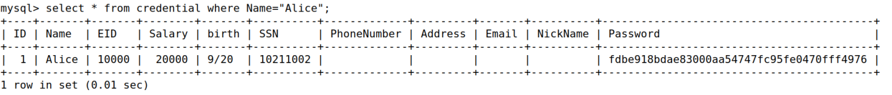
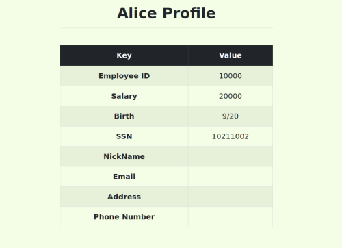
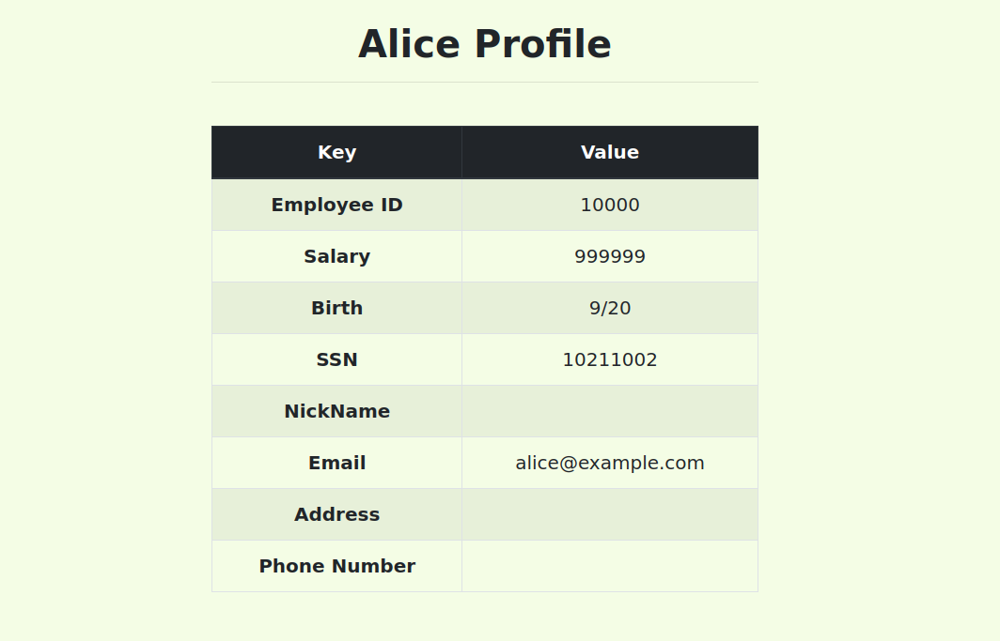
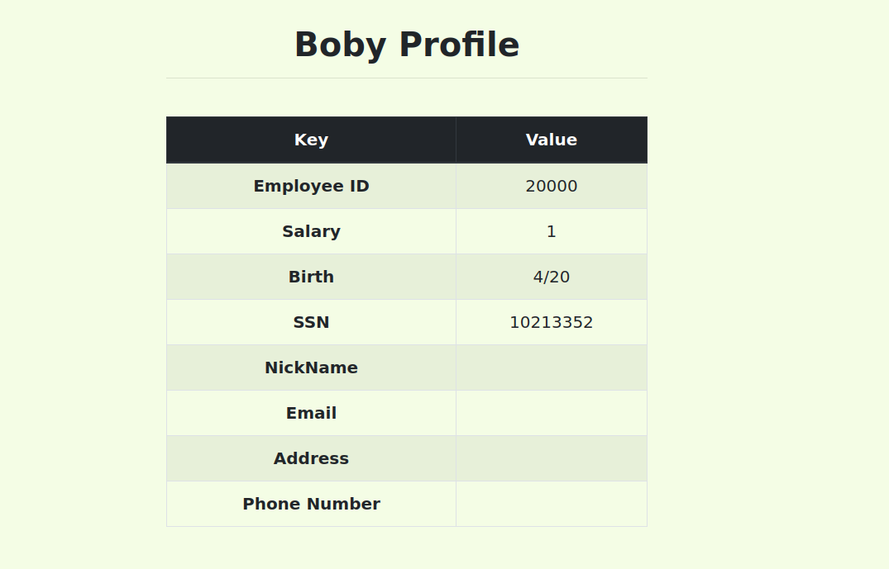

# CTF

## Challenge 1

### Recon

- We start by analysing the php code of the site we were trying to log in and trying out some SQL injection strings on the inputs.

### Vulnerability

- After analysing the php code of the authentication web site, we conclude that it was possible to that advantage of the authentication query: `"SELECT username FROM user WHERE username = '".$username."' AND password = '".$password."'";`. This verification query is unsafe, because someone can override the query, by making some especific input in the username and/or password.

- Finaly, we conclude that there were many ways to do an SQL injection attack on this website, and it is even necessary to input the admin username to entry with admin priviliges, because if we make an always true SQL statement, we enter as the first user, which in this case is the admin.

- So both this attacks area valid attacks and return the same priviliges:

- Attack 1
    - username: `admin`
    - password: `'or''='`

- Attack 2
    - username: `'or''='';`
    - password: `anything`

## Challenge 2

### Recon

- When we first start analysing the webpage, we found this section suspicious `Check out your network status! Here`. So we clicked and observed what this was for. It seemed to be an internet connection tester. However, after entering an website (www.google.com) to experiment, we quickly understood, that the results shown were directly from a linux command.

### Vulnerability

- The Vulnerability could be found in the input for the network connection checker, were we could issue whatever linux command we want, and observe its results, if we input a semicolon before, following this structure `;[linux command]`.

- In order to see what was inside the linux system we start issuing multiple `ls` commands, by inserting `!ls` in the input. After this command `;ls ../../../..`, we found the flag.txt file.

- After knowing the flag location, we just had to issue a command to print it out `;cat ../../../../flag.txt`.

# SEEDS Labs

## Task 1: Get Familiar with SQL Statements

- Firstly, we have done the database setup using Docker and opened a shell from the respective MySQL container, by inputting the correct user and password, through the command `mysql -u root -pdees`.

- Secondly, still in the opened shell we loaded the existing database through the command `use sqllab_users`.

- Finaly, we printed the private information of employee Alice using the following SQL statement `SELECT * from credential where Name="Alice";`. This step is shown in the following print screen:

## Task 2: SQL Injection Attack on SELECT Statement

### Task 2.1: SQL Injection Attack from webpage

- After observing the PHP code in unsafe_home.php, we conclude that the injection had to be done in the username input of login section, because the password inputted was protected with sha1 encryption. We formulated the following code `' = '' or ''=' `, that in conjunction with the verification SQL query in the web application code (unsafe_home.php), created a valid SQL statement that evaluated the WHERE condition to true, that gaves us the ability to log in, as an undefined user, retrieving only Alices emplyee information.

- As the password input is empty the condition or '' = ' is actualy '' = '', which is always true.

- We wanted to log in as the Admin user, so we created a similar code to input as the username, but in this case with the admin keyword in the beginning to evaluate the user as admin `admin' or ''='`.

### Task 2.2: SQL Injection Attack from command line

- This task was similiar to the previous one, but with the code to inject in the ASCII enconding that is correctly converted by the HTTP encoding while sending the request using curl command. With this in mind we formulated the following command `curl 'www.seed-server.com/unsafe_home.php?username=%27%20%3D%20%27%27%20or%20%27%27%20%3D%20%27&Password=lucas'`, which does exactly the same as this input `' = '' or ''=' ` in the [Task 2.1](#task-21-sql-injection-attack-from-webpage), but with the previously explained encoding. 

- This first command did not loged in with admin priviliges, so we created a new command equivelant to this `admin' or ''='`, but with the right enconding for the HTTP. curl `'www.seed-server.com/unsafe_home.php?username=admin%27%20or%20%27%27%20%3D%20%27&Password=lucas'`.

### Task 2.3: Append a new SQL statement.

- We found that the countermeasure was using the PHP function `query()`, which only allows to execute one SQL statement, like it is exposed in this PHP reference site [PHP query() reference](https://www.php.net/manual/en/mysqli.query.php). In order to execute two SQL statements it would be needed the `multi_query()` PHP function.

## Task 3: SQL Injection Attack on UPDATE Statement

### Task 3.1: Modify your own salary

- In order to modify our own salary (Alices salary in this case, as we logged into her account), we had to close one of the inputs we had available with `'` to close this email input, followed by a colon and salary (column keyword) with the value we wanted.

- The final statement injected was this: `alice@example.com',salary='999999`.

- We obtain this results:

### Task 3.2: Modify other people’ salary

- In order to modify other people salary we did the following input, `',salary=1 where Name='Boby';#`, in the email tab as in the previous attack. This way we alter Boby's salary, by using his name in the where SQL condition. In the end of the statement it is needed the `#`in order to comment the rest of the original sql statement in the server.

- We obtain this results:

